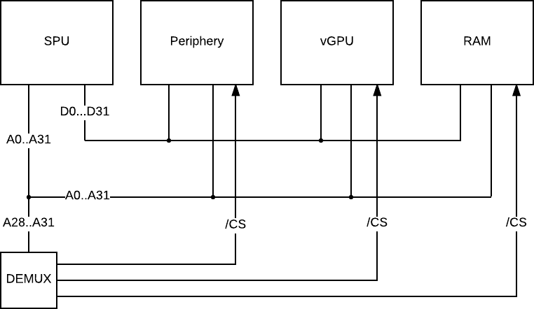

# DasOS Virtual Platform

## Overview

## SPU

## Periphery

## vGPU

## RAM

## DEMUX
The demultiplexer selects the correct memory mapping depending on the
system configuration. The selection is made by the upper four bits of 
the requested address.